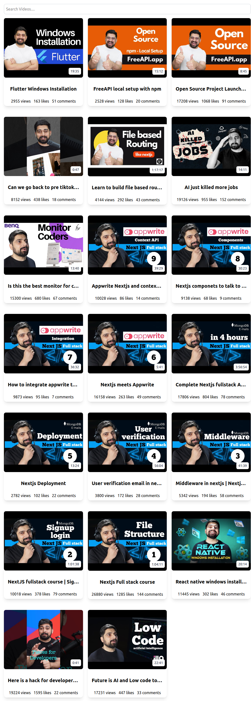

# Youtube Video Listing:

A simple web application that provides a list of videos and a search functionality with inifinite scrolling.

## Features:

- **Get Videos**: Fetch videos and list them.
- **Client-Side Search**: Search videos.
- **Infinite Scrolling**: Fetch new videos and scroll through the app looking for videos.

## Screenshots:

### Web-Page:

### Mobile-Page:

## Deployment Link:

You can access the live version of the app here:  
[Youtube Video Listing](https://videolistingandsearch.netlify.app/)

## Technologies Used:

- HTML, CSS, and JavaScript for the front-end
- Fetch API to retrieve videos.
